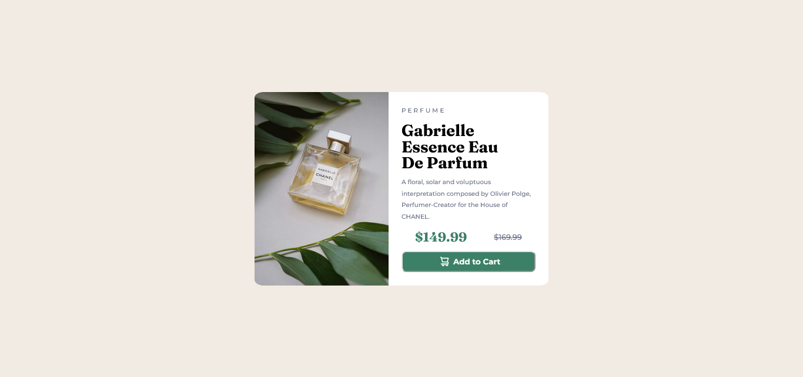

# Frontend Mentor - Product preview card component solution

This is a solution to the [Product preview card component challenge on Frontend Mentor](https://www.frontendmentor.io/challenges/product-preview-card-component-GO7UmttRfa). Frontend Mentor challenges help you improve your coding skills by building realistic projects. 

## Table of contents

- [Overview](#overview)
  - [The challenge](#the-challenge)
  - [Screenshot](#screenshot)
  - [Links](#links)
- [My process](#my-process)
  - [Built with](#built-with)
  - [What I learned](#what-i-learned)
  - [Continued development](#continued-development)
  - [Useful resources](#useful-resources)
- [Author](#author)
- [Acknowledgments](#acknowledgments)


## Overview

### The challenge

Users should be able to:

- View the optimal layout depending on their device's screen size
- See hover and focus states for interactive elements

### Screenshot




### Links

- Solution URL: [Add solution URL here](https://your-solution-url.com)
- Live Site URL: [Add live site URL here](https://your-live-site-url.com)

## My process

### Built with

- Semantic HTML5 markup
- CSS custom properties
- Flexbox
- media queries

### What I learned

Si el border-radius no está funcionando, la mejor solucion es darle overflow:hidden a la caja contenedora.

Usar la etiqueta <picture> en el HTML te permite colocar dos imagenes en un mismo lugar y elegir cuál de las dos mostrar de acuerdo al width de la pantalla. Con este función se ahorra código en el stylesheet.
  
Si se define un cambio estético del border durante el :hover, debe entonces definirse también cómo será su border ANTES del :hover, de otra forma el navegador le colocará un borde negro por default.

```html

  
  
  
```
```css

  
  
  
```
- Frontend Mentor - [@MaxiJRom](https://www.frontendmentor.io/profile/MaxiJRom)
